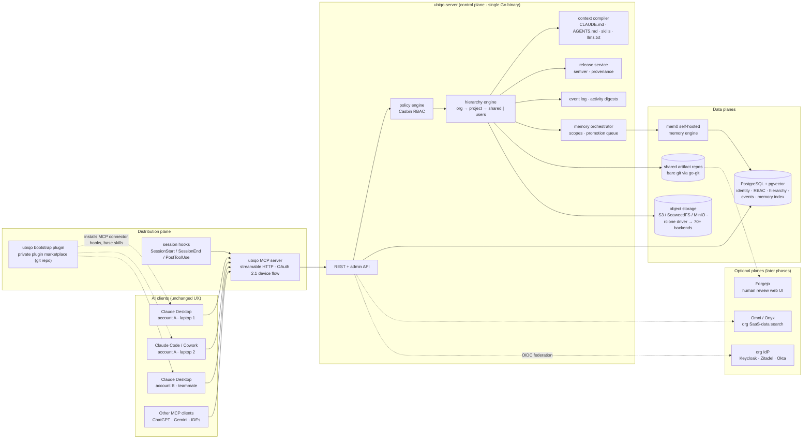
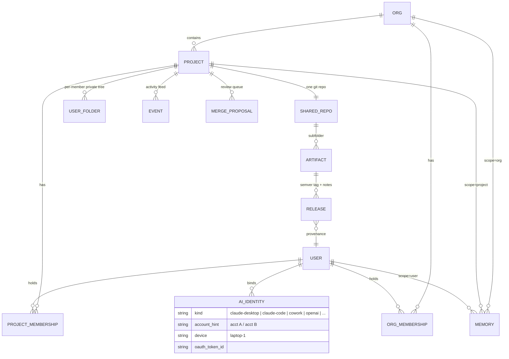

# Ubiqo Architecture — Technical Design v0.1

**Date:** 2026-07-13
**Status:** Design proposal (follows from [`docs/research/omni-gap-analysis.md`](../research/omni-gap-analysis.md))
**Goal:** a free, self-hostable **context fabric** that centralizes memories, projects, skills, instructions, and artifacts across multiple Claude (or other AI-provider) accounts and machines — org → project → user hierarchy, RBAC, semantic versioning, and instruction-driven collaboration — while the AI clients people already use remain the interface.

---

## 0. Design tenets

1. **Distribution-side, not ingestion-side.** We push context *into* AI clients over MCP; we don't build another chat UI silo.
2. **Own the identity, abstract the AI account.** Humans are ubiqo users; Claude accounts, machines, and other providers' clients are just *bound identities* of a user. Never attempt to bridge Anthropic accounts directly.
3. **Steal boring infrastructure, build only the fabric.** Git already does versioning + merge + provenance; Postgres already does storage/search/queues; mem0 already does memory extraction; rclone already speaks 70+ clouds. The greenfield code is the *hierarchy, policy, compilation, and distribution* layer nobody ships.
4. **The protocol is files + git + MCP.** Everything an agent touches is inspectable with `ls`, `git log`, and a Postgres query. No proprietary formats; power users can bypass ubiqo tooling and nothing breaks.
5. **Progressive disclosure.** Sessions start with a small compiled context bundle + indexes (`llms.txt`-style); agents fetch detail on demand. The org brain never gets bulk-dumped into a context window.

---

## 1. System overview



**Five planes:**

| Plane | Job | Backed by |
|---|---|---|
| **Control** | identity mapping, RBAC, hierarchy state, events, releases, memory index | ubiqo-server + PostgreSQL (+pgvector) |
| **Context** | org/project/user trees; compiled instruction bundles | hierarchy engine + context compiler |
| **Artifact** | versioned shared work products | bare git repos (go-git) + object storage for large/binary blobs |
| **Memory** | extract, scope, promote, recall | mem0 self-hosted (pgvector store), behind a `MemoryProvider` interface |
| **Distribution** | get all of the above *into* every client | MCP server + bootstrap plugin + hooks + roaming-profile sync |

---

## 2. The hierarchy engine

### 2.1 Logical layout (what agents and humans see)

```
acme/                                  ← org (company/team parent)
├── context/                           ← compiled: CLAUDE.md, AGENTS.md, skills/, llms.txt
├── policy.yaml                        ← org roles, defaults, collaboration rules (source for compiler)
└── projects/
    └── website-redesign/              ← project (1:1 with a Claude project/folder)
        ├── project.yaml               ← members+roles, settings, client mappings
        ├── context/                   ← compiled per-project CLAUDE.md, skills/, llms.txt
        ├── shared/                    ← ONE git repo — the collaboration surface
        │   ├── api-design/            ← artifact dir → semver tags artifacts/api-design/vX.Y.Z
        │   ├── brand-kit/
        │   └── .locks/                ← advisory locks (see §5.4)
        └── users/
            ├── jon/                   ← private tree (object store; ACL: jon + org admins only)
            └── sam/
```

- **Org** = tenant root. Holds policy, org-wide context, org-scoped memory, the member registry.
- **Project** = unit of collaboration, mapping 1:1 to a Claude project/folder (see §2.3).
- **`shared/`** = a real git repository. Every artifact is a subfolder; versioning, merging, history, and blame come from git, surfaced through MCP tools so agents never need raw git (but humans can `git clone` it — tenet 4).
- **`users/<name>/`** = private-by-default trees in object storage. Not indexed for anyone else; promotion to `shared/` is an explicit, reviewed act.

### 2.2 Data model (control plane)



The **`AI_IDENTITY`** table is the answer to problem statement 1: a ubiqo user binds *N* client identities (Claude account A on laptop 1, Claude account B on the desktop, a ChatGPT client, …). Every MCP call carries a device-scoped OAuth token → resolves to a ubiqo user → RBAC applies to the *human*, and all writes are attributed to them regardless of which subscription executed the work.

### 2.3 The 1:1 mapping to "a Claude project", per client type

There is no public API to programmatically manage claude.ai Projects, so the mapping is **convention + compilation**, which works everywhere:

| Client | How a ubiqo project binds |
|---|---|
| **Claude Code / Cowork (folder-based)** | The project directory contains `ubiqo.yaml` (project id) + the compiled `context/CLAUDE.md` is included from the repo-root `CLAUDE.md`. Hooks read `ubiqo.yaml` to know which project to pull/push. |
| **Claude Desktop / claude.ai Projects** | The ubiqo MCP connector is added to the Project; the compiled **project-instructions block** (generated by the context compiler, copy-paste or synced by the ubiqo-agent CLI) pins `project=website-redesign` so every chat in that Project resolves to the right scope. |
| **Other MCP clients** | Same connector; project selected via `set_active_project` tool or per-client default. |

---

## 3. Identity, authN, authZ

### 3.1 Roles (RBAC)

| Scope | Roles | Powers |
|---|---|---|
| Org | `owner` / `admin` / `member` / `guest` | manage org, projects, members / read org context |
| Project | `maintainer` / `contributor` / `viewer` | merge+release / propose+write own branches+private tree / read shared |

- Enforcement point #1: **the MCP tool layer** — every tool call is `(user, role, scope, action)` checked through Casbin before touching data.
- Enforcement point #2: **the data planes** — git refs writable only via the server; object-store paths ACL'd per user folder.
- **Shared/org agents run as service identities** with their own narrow role — never with a member's credentials (avoiding Omni's confused-deputy design, where org agents execute with the *creator's* permissions).

### 3.2 AuthN

- Clients authenticate against ubiqo's OAuth 2.1 authorization server (the MCP remote-server auth model): GUI clients (Claude Desktop/Cowork connectors) use the standard **authorization-code + PKCE** browser flow; the CLI/hooks path uses **device flow** — first session on a new machine prints a code + URL, the user approves once, and a token scoped to that client+machine is stored.
- Humans: email magic-link or OAuth (library-level), with **optional OIDC federation** (Keycloak/Zitadel/Okta) for orgs that have an IdP. We do not build a bespoke IdP.

---

## 4. Context compilation & distribution (requirement 6 — the novel part)

The **context compiler** turns hierarchy state + `policy.yaml` + templates into per-scope bundles:

- `CLAUDE.md` (org level, included by project level) — collaboration protocol, RBAC etiquette ("you are `contributor`; propose, don't merge"), lock rules, release conventions.
- `AGENTS.md` — same content, cross-vendor standard; CLAUDE.md stays a thin include (interop hedge).
- `skills/` — org- and project-scoped skills (e.g., `release-artifact`, `promote-memory`, `project-onboarding`), versioned like any artifact.
- `llms.txt` — index of the project: artifacts + latest releases, members, recent activity — so agents *navigate* instead of bulk-loading.

Example compiled project `CLAUDE.md` (abridged):

```markdown
# website-redesign — ubiqo project context (compiled v2026.07.13-3, do not hand-edit)
You are operating inside org `acme`, project `website-redesign`, as ubiqo user `jon` (role: contributor).

## Collaboration protocol
- Shared artifacts live in `shared/` (git-backed). NEVER edit `shared/` directly:
  use `write_artifact` (creates your branch) then `propose_merge`.
- Before large edits to an artifact, `lock` it; locks expire in 2h.
- Releases are semver: breaking structure/decisions = major, additive = minor, fixes = patch.
- Your private scratch space is `users/jon/`. Promote with `propose_merge`.

## Where things are (fetch on demand — do not preload)
- Artifact index + latest releases: call `get_context(section="artifacts")`
- Team activity since your last session is injected at session start.
```

**Distribution channels:**

1. **Bootstrap plugin** in a private **Claude Code plugin marketplace** (a git repo ubiqo hosts). Installing `ubiqo` delivers: the MCP connector config, the hooks, base skills, and the CLAUDE.md include shim. Updating the plugin updates every member org-wide. This is the Anthropic-idiomatic channel.
2. **Hooks** (shipped by the plugin):

```json
{
  "hooks": {
    "SessionStart": [{ "hooks": [{ "type": "command", "command": "ubiqo ctx pull --inject" }] }],
    "SessionEnd":   [{ "hooks": [{ "type": "command", "command": "ubiqo ctx push --events --memory-candidates" }] }]
  }
}
```

3. **ubiqo-agent CLI** (`ubiqo`) — device auth, hook implementation, roaming-profile sync (§7), and manual commands (`ubiqo init`, `ubiqo promote`, `ubiqo whoami`).

---

## 5. Artifact versioning & collaboration (requirements 3, 5)

### 5.1 MCP tool surface (the day-to-day API)

| Tool | Role required | What it does |
|---|---|---|
| `whoami` / `set_active_project` | any | identity + scope resolution |
| `get_context(section?)` | viewer | compiled bundle, artifact index, member list |
| `search(query, scope)` | viewer | hybrid FTS+vector over shared artifacts, releases, events (RBAC-filtered) |
| `read_artifact(name, ref?)` | viewer | file(s) at `main`, a tag (`v1.3.0`), or a proposal branch |
| `write_artifact(name, files, base)` | contributor | commit onto caller's branch `u/<user>/<artifact>`; provenance trailers |
| `propose_merge(name, summary)` | contributor | opens MERGE_PROPOSAL; event emitted |
| `review_merge(id)` / `merge(id)` | maintainer | diff review; merge to main (git merge; conflicts → back to proposer with conflict report) |
| `release_artifact(name, bump, notes)` | maintainer | semver tag `artifacts/<name>/vX.Y.Z` + release record + changelog |
| `lock(name)` / `unlock(name)` | contributor | advisory lock file in `.locks/` with TTL |
| `remember(text, scope=user)` / `recall(query, scopes)` | member | memory plane (§6) |
| `propose_memory_promotion(id, to_scope)` / `approve_memory(id)` | member / maintainer | promotion workflow |
| `activity(since?)` | viewer | event feed slice |
| `read_private` / `write_private(path)` | owner only | the caller's `users/<me>/` tree |

Admin tools (`create_project`, `add_member`, `set_role`, `bind_identity`) exist but are typically console/CLI operations.

### 5.2 Provenance

Every commit written through ubiqo carries trailers:

```
Ubiqo-User: jon
Ubiqo-Identity: claude-desktop/account-A/laptop-1
Ubiqo-Session: 2026-07-13T14:22Z-8f3a
Model: claude-fable-5
```

`git log` *is* the audit trail for artifacts; the EVENT table is the audit trail for everything else (append-only).

### 5.3 Semver semantics for non-code artifacts

Encoded in the org CLAUDE.md so agents apply them consistently: **major** = decisions/structure changed such that consumers must re-read (breaking); **minor** = additive sections/content; **patch** = corrections. Releases are immutable snapshots — agents are instructed to *depend on tags, not `main`* when consuming another artifact.

### 5.4 Concurrency

Git merge handles text conflict resolution; the advisory-lock protocol (a `.locks/<artifact>` file with owner+TTL, honored because the compiled instructions say so) prevents most conflicts *before* they happen. CRDTs are deliberately out of scope until real-time co-editing is a requirement (tenet 3).

---

## 6. Memory subsystem (requirements 2, 7 — the "shared brain")

```
scopes:  user (default, private)  →  project  →  org
                     promotion is a reviewed act ("a PR for memories")
```

- **Engine:** mem0 self-hosted (extraction, consolidation, dedup, recall) configured with **pgvector** as the vector store — no extra vector DB service. Behind ubiqo's `MemoryProvider` interface so Letta or Graphiti can be swapped/added per org (both validated OSS; Zep's platform has drifted SaaS).
- **Write paths:** explicit `remember` tool calls; SessionEnd hook submits *candidates* extracted from the session summary. Candidates land in the caller's **user scope** only.
- **Promotion:** `propose_memory_promotion` → maintainer review (console queue or `approve_memory` tool) → project/org scope. Prevents shared-noise pollution; mirrors Anthropic's own project-boundary guardrail design, but adds the *shared pool* Anthropic doesn't offer.
- **Read paths:** SessionStart digest (top-k per scope, recency+relevance ranked) + on-demand `recall`. Hygiene: TTL/decay policies per scope in `policy.yaml`; incognito escape hatch (`UBIQO_NO_MEMORY=1` honored by hooks).

---

## 7. Cross-device & cross-account continuity (requirements 7, 8 → problem statements P1, P2)

Three reinforcing mechanisms, weakest-to-strongest:

1. **Server-side context (always on).** Artifacts, memories, events, instructions all live server-side; *any* authenticated client on *any* machine gets the same compiled bundle. This alone makes a second computer functionally continuous.
2. **Activity feed as presence.** Every session emits events (`session.started`, `artifact.written`, `merge.proposed`, `release.published`, `session.summary`). SessionStart injects the digest — so account B's Claude *narrates* what account A's Claude did: "Yesterday 18:40, jon (via account A/laptop-1) released api-design v1.4.0 — summary: …".
3. **Roaming profile (opt-in).** `ubiqo sync` (wrapping **rclone bisync** against the org object store) syncs the local Cowork/Claude Code state directory — session summaries, todo lists, `.claude/` project settings — hub-and-spoke through storage the org already controls. SessionStart rehydrates: "You were mid-task on X on your other machine; todos: […]".

```mermaid
sequenceDiagram
  autonumber
  participant L1 as Laptop 1 · Claude acct A
  participant L2 as Laptop 2 · Claude acct B (same human)
  participant M as ubiqo MCP
  participant S as ubiqo-server

  L1->>M: SessionEnd hook: push events + session summary + memory candidates
  M->>S: store (attributed: user=jon, identity=acct-A/laptop-1)
  Note over L1,S: ── evening: jon switches machines & accounts ──
  L2->>M: SessionStart hook: get_context(project)
  M->>S: authZ: device token → user=jon (acct B binding) → contributor
  S-->>L2: compiled context + digest: "your session on laptop-1 did X; todo Y; api-design at v1.4.0"
```

---

## 8. A day at Acme (end-to-end walkthrough)

**Cast:** Jon (ubiqo user; Claude account A on laptop-1, Claude account B on the studio desktop) and Sam (teammate; her own Claude subscription). Project `website-redesign`; Jon `contributor`, Sam `maintainer`.

**09:00 — Jon, laptop-1, account A.** Opens Claude Code in the project folder. SessionStart hook pulls the bundle: compiled instructions, memory digest ("client prefers Tailwind v4 — project scope"), activity digest ("Sam released `brand-kit` v2.1.0 last night: new palette"). No re-explaining anything — *that's the duplication problem gone*.

**09:05.** Jon's agent drafts an API redesign in `users/jon/api-notes/` (private). Mid-morning it matures: agent calls `lock("api-design")`, `write_artifact` (branch `u/jon/api-design`), then `propose_merge` with a summary. Event emitted; lock released on propose.

**11:30 — Sam, her machine, her account.** Her SessionStart digest surfaces the proposal. Her agent `review_merge`s the diff, she approves, agent `merge`s and `release_artifact("api-design", bump="minor")` → **v1.4.0**, changelog auto-generated from trailers. RBAC did the governance: Jon *couldn't* merge; Sam could.

**14:00 — Sam asks her Claude something Jon's Claude learned last week.** `recall("auth vendor decision", scopes=["project"])` hits the promoted memory Jon's session proposed and Sam approved on Tuesday. Two different Claude subscriptions, one brain — *problem statement 1 resolved by architecture, not workarounds*.

**19:00 — Jon at the studio desktop, account B (Cowork).** Roaming profile rehydrates his todos from laptop-1; the digest says where he left off; `read_artifact("api-design", ref="v1.4.0")` pins the released version. *Problem statement 2 resolved*: continuity came from the fabric, not from the machine.

**Friday.** A maintainer skims the memory-promotion queue (3 candidates), approves 2, expires 1. The org CLAUDE.md gets a policy tweak; the context compiler bumps the bundle version; every member's next session picks it up via the plugin/hook path. Best practices propagate without a meeting.

---

## 9. Requirement traceability

| # | Requirement | Satisfied by |
|---|---|---|
| 1 | Self-hostable, free, OSS | Single Go binary + Docker Compose; every dependency FOSS (§10); ubiqo itself Apache-2.0 |
| 2 | Pluggable cloud storage | rclone-backed storage driver (S3/GCS/Azure/Drive/70+); bundled SeaweedFS/MinIO default; Postgres for metadata |
| 3 | Org → project → individual/shared folders | Hierarchy engine (§2): materialized trees + one git repo per project `shared/` + ACL'd `users/<u>/` |
| 4 | RBAC | Casbin policies at the MCP tool layer + data-plane ACLs; org/project role matrices (§3.1); service identities for shared agents |
| 5 | Semantic versioning of shared artifacts | Release service on git tags `artifacts/<name>/vX.Y.Z`, immutable releases, changelogs, depend-on-tags convention (§5) |
| 6 | Instructions orchestrating collaboration | Context compiler → per-scope CLAUDE.md/AGENTS.md/skills/llms.txt; distributed via plugin marketplace + hooks (§4) |
| 7 | Multi-account awareness | AI_IDENTITY binding (§2.2) + shared MCP fabric + activity feed + scoped shared memory (§6, §7) |
| 8 | Cross-device continuity | Server-side state + SessionStart rehydration + opt-in roaming profile via rclone bisync (§7) |
| P1 | Two accounts, no shared awareness | §7 mechanisms 1–2 + identity mapping: both accounts resolve to one user (or two users in one project) |
| P2 | Two computers, no Cowork continuity | §7 mechanisms 1–3 |

---

## 10. FOSS bill of materials

### Adopt (day one)

| Component | License | Role in ubiqo | Why this one |
|---|---|---|---|
| **PostgreSQL** 16+ | PostgreSQL | control plane: identity, RBAC, hierarchy, events, merge queue, memory index; table-based job queue | One database for storage+search+queue is Omni's best validated bet; ops simplicity is the product |
| **pgvector** | PostgreSQL | memory recall + artifact semantic search | No separate vector DB service; mem0 supports it natively |
| **mem0 (self-hosted)** | Apache-2.0 | memory engine (extract/consolidate/recall) | OpenMemory's designated successor; also Omni's internal choice — two independent validations |
| **go-git** | Apache-2.0 | embedded git for `shared/` repos (bare, server-managed) | Versioning/merge/blame/provenance for free; no second user system to reconcile (vs. running a forge) |
| **rclone** | MIT | storage driver (S3/GCS/Azure/Drive/…) + `bisync` for roaming profiles | 70+ backends for the cost of one integration; Basic Memory's paid sync is literally rclone — we ship it free |
| **SeaweedFS** (default) or MinIO | Apache-2.0 / AGPL-3.0 | bundled object store for compose deployments | S3-compatible; SeaweedFS preferred for the permissive license |
| **MCP SDK (Go)** — official | MIT | the distribution plane server | Protocol compliance, streamable HTTP + OAuth handled; the moat is *not* the transport |
| **Casbin** | Apache-2.0 | embedded RBAC policy engine | Role matrices in §3.1 without building a policy DSL; OpenFGA is the scale-up path if per-artifact grants get relational |
| **SvelteKit** (or Next.js) | MIT | thin admin console (org/RBAC admin, promotion queue, feed) | Console can lag the API; any mainstream framework fine |

### Integrate later (optional planes)

| Component | License | Role | Trigger to adopt |
|---|---|---|---|
| **Omni** (getomnico) or **Onyx** | Apache-2.0 / MIT | enterprise search over org SaaS data (Slack/Drive/Jira), wrapped behind ubiqo's MCP | Users ask for "search our Slack from Claude"; also watch Omni for an MCP-server endpoint |
| **Forgejo** | GPL-3.0+ | human web UI for reviewing `shared/` repos (PR-style) | Non-agent reviewers want a browser diff view; OIDC-federate to ubiqo identity |
| **Keycloak / Zitadel** | Apache-2.0 | enterprise SSO federation | First customer org with an IdP requirement |
| **Letta / Graphiti** | Apache-2.0 | alternative `MemoryProvider` implementations (agent-OS paging / temporal KG) | Memory-quality needs outgrow mem0 |
| **docling** | MIT | PDF/Office extraction when indexing binary artifacts for search | Artifact search over non-text formats |
| **age** | BSD-3 | per-user encryption of private trees | Privacy posture beyond ACLs |

### Deliberately NOT adopting (and why)

- **Omni as the base platform** — wrong category (ingestion-side search silo); pre-1.0 fork tax; no MCP server (see gap analysis).
- **OpenMemory MCP** — being sunset; Mem0 self-hosted is its named successor.
- **Zep platform** — SaaS-first drift; Graphiti (the OSS engine) is the usable piece if we ever want temporal KG memory.
- **Kafka / Redis / RabbitMQ** — Postgres row-locked queue tables suffice at this scale (Omni proved it); every service removed is a feature for self-hosters.
- **A CRDT engine (Yjs/Automerge)** — git merge + advisory locks cover agent-paced collaboration; revisit only for real-time co-editing.
- **A dedicated vector DB (Qdrant/Weaviate)** — pgvector until proven insufficient.
- **Building an IdP** — device flow + magic links + optional OIDC federation; identity *mapping* is our value-add, not identity *provision*.

---

## 11. Greenfield build list

| # | Component | Size | Notes |
|---|---|---|---|
| G1 | **ubiqo-server core** — hierarchy engine, RBAC integration, identity mapping, REST API, event log, merge-proposal + release services | **L** | The heart. Go, single static binary, embeds go-git + Casbin |
| G2 | **MCP layer** — tool surface of §5.1 over the core, OAuth 2.1 device flow | **M** | SDK does transport; care goes into tool ergonomics + RBAC mapping |
| G3 | **Context compiler** — templates + policy + state → CLAUDE.md/AGENTS.md/skills/llms.txt bundles, versioned | **M** | The genuinely novel piece; highest leverage per line of code |
| G4 | **Memory orchestrator** — scopes, candidate intake, promotion queue, digests over mem0 | **M** | Engine is FOSS; workflow is ours |
| G5 | **ubiqo-agent CLI** — device auth, hook handlers, `ctx pull/push`, roaming-profile sync (wraps rclone) | **M** | Ships inside the bootstrap plugin |
| G6 | **Bootstrap plugin + private marketplace repo** — MCP config, hooks, base skills, CLAUDE.md shim | **S** | Standard Claude Code plugin format |
| G7 | **Admin console** — org/project/member admin, promotion queue, activity feed | **M** | Can lag; CLI covers admin day one |
| G8 | **Content** — org/project instruction templates, base skills (`release-artifact`, `promote-memory`, onboarding), docs + our own `llms.txt` | **S**, ongoing | Templates ARE the product's opinion |

### Build phases (each phase ships something usable)

| Phase | Scope | Proves |
|---|---|---|
| **P0 — fabric** | G1 (minus promotion) + G2 + minimal G3: hierarchy, git-backed `shared/`, releases, `get_context`/`read/write_artifact`/`release` tools, device auth | Single team collaborating through two Claude accounts — **P1 & P2 solved in primitive form** |
| **P1 — governance** | Full RBAC + merge proposals + activity feed + provenance trailers | Safe multi-user collaboration |
| **P2 — memory** | G4 + digests + promotion workflow | The shared brain |
| **P3 — distribution polish** | G5 + G6 + roaming profiles + G7 console | Zero-friction onboarding; Cowork continuity complete |
| **P4 — knowledge substrate** | Omni/Onyx integration behind MCP; Forgejo review UI; IdP federation | Enterprise-shaped deployments |

---

## 12. Deployment topology

**Compose (default):** `postgres` (with pgvector) · `ubiqo-server` (API + MCP + compiler + git, one container) · `mem0` · `seaweedfs` (optional if using external S3/GCS) · `console` (optional). Reverse proxy (Caddy) for TLS — the MCP endpoint must be HTTPS for remote clients.

**Single-binary goal:** `ubiqo serve` with embedded migrations; external requirements only Postgres + any S3-compatible endpoint. Terraform modules later, mirroring Omni's AWS/GCP pattern.

**Backups = the ops story:** `pg_dump` + object-store replication + `git bundle` per project repo. Everything restorable independently.

---

## 13. Security & privacy notes

- Private `users/<u>/` trees: ACL-enforced at every read path; optional `age` encryption with user-held keys (org admins can *delete* but not *read* when enabled).
- Shared/org agents run as **service identities** with narrow roles (no confused deputy).
- Device tokens are client+machine scoped and individually revocable (`ubiqo devices revoke`).
- Compiled context bundles never embed secrets; the compiler refuses `policy.yaml` keys matching secret patterns.
- Append-only EVENT log; releases immutable; git history rewrite disabled on the server.
- Memory candidates are quarantined in user scope until reviewed — a prompt-injected agent cannot poison org memory alone.

## 14. Open questions

1. **Merge-conflict UX for non-git users** — how much conflict resolution can agents own before a human needs a diff view (Forgejo trigger)?
2. **Memory quality at scale** — dedup/decay tuning across scopes; when does Graphiti's temporal model earn its complexity?
3. **claude.ai Projects sync** — instructions block is manual-paste today; watch for a Projects API to automate the 1:1 binding.
4. **Multi-org federation** — contractors belonging to two orgs; cross-org artifact sharing (out of scope for v0).
5. **License for ubiqo itself** — Apache-2.0 (max adoption) vs AGPL (SaaS-wrap protection). Leaning Apache-2.0 per requirement 1's spirit.
